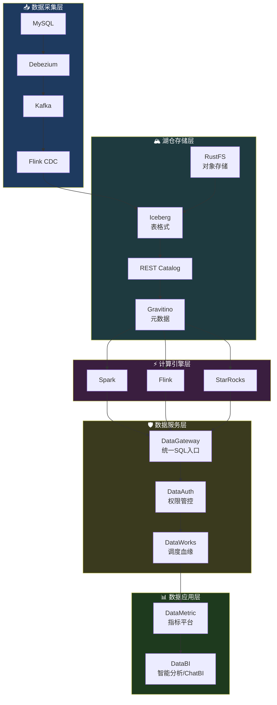
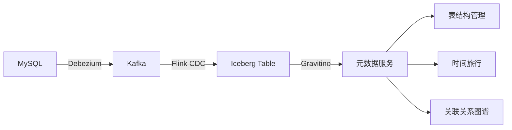
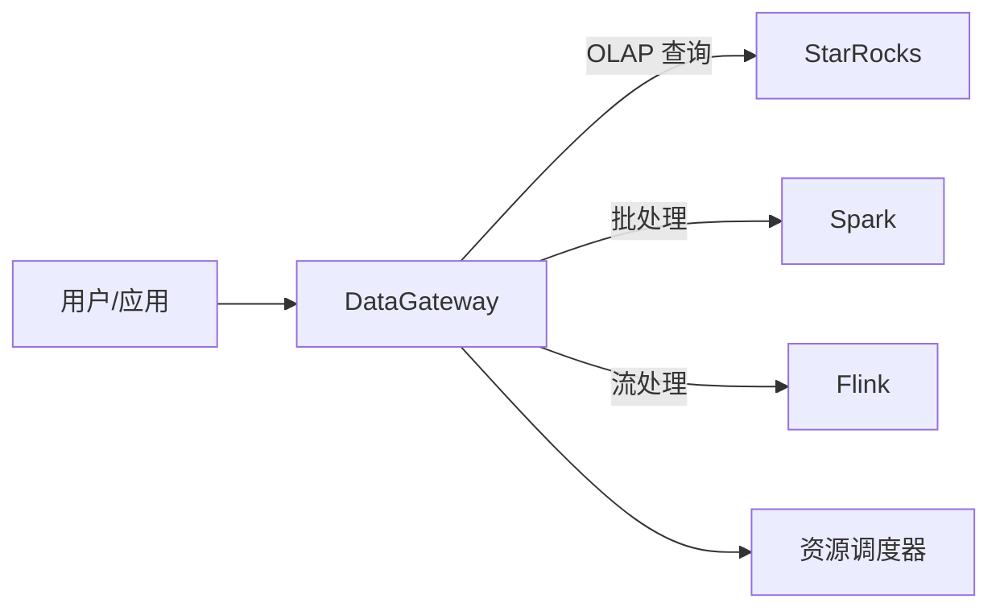
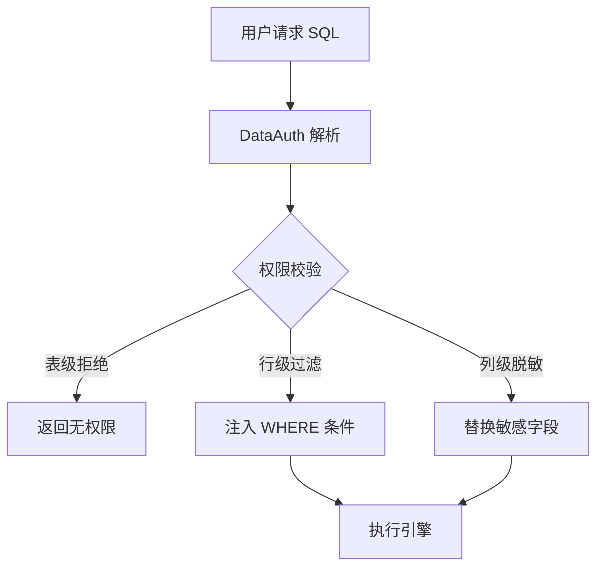
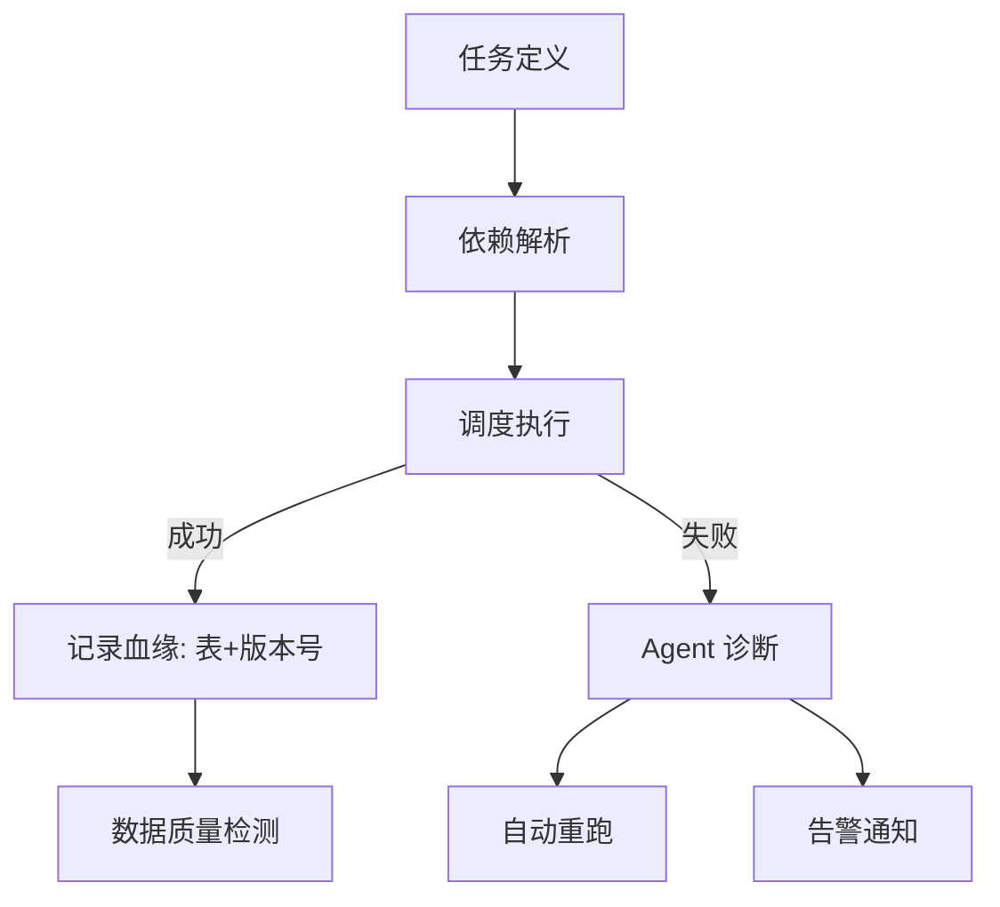
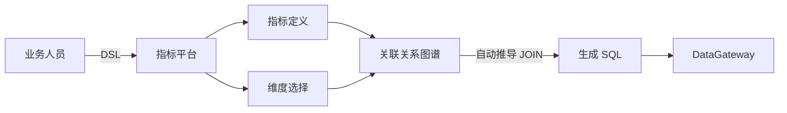
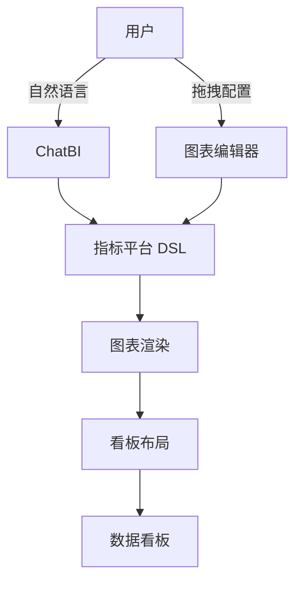
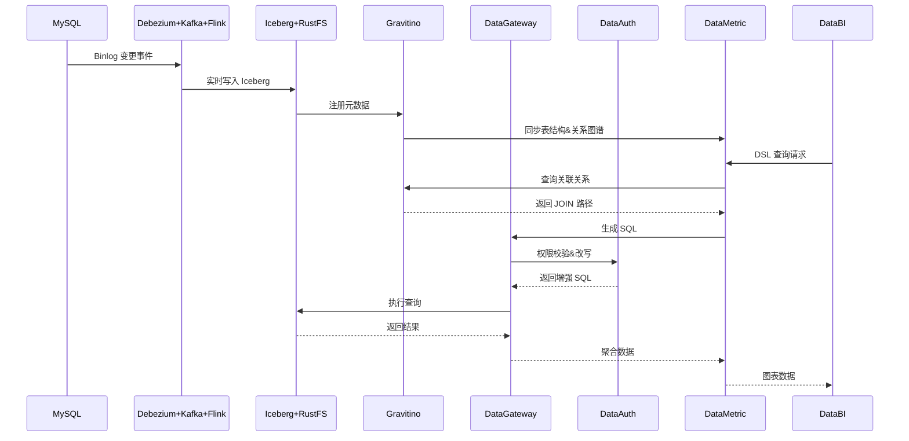

<div align="center">

<!-- 动态打字效果标题 -->
<a href="https://github.com/cyan-daimao">
  
</a>

<br><br>

<!-- 状态徽章 -->
<a href="https://github.com/cyan-daimao">
  
</a>
<a href="https://github.com/cyan-daimao?tab=followers">
  
</a>
<a href="https://github.com/cyan-daimao?tab=repositories">
  
</a>

<br><br>

🏗️ **数据中台架构师** | 🏔️ **Lakehouse 实践者** | 🔗 **实时数据链路**

致力于打造**湖仓一体、存算分离**的企业级数据平台，覆盖从数据采集到智能分析的全链路。

<br>

<!-- 社交链接 -->
<a href="https://github.com/cyan-daimao">
  
</a>
&nbsp;
<a href="https://cyan-daimao.github.io">
  
</a>

</div>

---

## 🏗️ 数据平台全景

> 一个覆盖 **数据采集 → 存储治理 → 计算分析 → 智能应用** 的完整数据中台



---

## 📁 核心项目

### 🏔️ rustfs + iceberg + restcatalog — 湖仓一体存储引擎
**定位：数据仓库基座，存算分离**

- **RustFS**：自研对象存储，为数据湖提供高可靠、低成本的存储底座
- **Iceberg**：开放表格式，支持 ACID、隐藏分区、时间旅行（Time Travel）
- **REST Catalog**：标准化的元数据服务接口，实现多引擎元数据统一

```
存算分离架构：
  计算层 (Spark/Flink/StarRocks)
       ↓ REST API
  REST Catalog (元数据服务)
       ↓
  Iceberg 表格式 (RustFS 对象存储)
```

---

### 📡 cyan-dataman — 数据采集 & 元数据平台
**定位：数据入湖 + 元数据治理中枢**

**📥 数据采集（CDC）**
- **MySQL Debezium** → **Kafka** → **Flink CDC** 实时数据捕获链路
- 支持增量同步、断点续传、Schema 变更自动适配

**🗃️ 元数据平台**
- **Gravitino + Iceberg + Spark** 构建统一元数据管理层
- **表结构管理**：字段类型、分区策略、版本演进
- **时间旅行（Time Travel）**：基于 Iceberg 快照实现历史数据回溯
- **关联关系图谱**：记录表之间的 JOIN 关系，为指标聚合提供图谱基础



---

### 🌐 cyan-datagateway — 数据网关
**定位：统一 SQL 执行入口，资源调度中心**

- **多引擎统一入口**：将 StarRocks、Spark、Flink 封装为统一的 SQL 执行服务
- **智能路由**：根据 SQL 特征自动选择最优执行引擎
- **资源分配**：配额管理、队列调度、并发控制
- **SQL 解析增强**：权限拦截、SQL 改写、执行计划分析



---

### 🔐 cyan-dataauth — 数据权限中心
**定位：细粒度数据安全管控**

- **表级权限**：控制用户对数据表的访问范围
- **行级权限**：基于条件过滤的行数据管控（如 `WHERE region='CN'`）
- **列级权限**：敏感字段脱敏与访问控制
- **权限申请流**：对外提供自助化权限申请、审批工作流
- **SQL 增强服务**：运行时注入权限条件，对上层透明



---

### ⏱️ cyan-dataworks（规划中）— 调度系统 & 血缘治理
**定位：任务调度 + 数据血缘 + 质量保障**

- **任务调度**：Spark / Flink 作业的编排调度，支持依赖管理、失败重试
- **血缘追踪**：通过依赖表和版本号自动记录数据血缘链路
- **Agent 智能运维**：
  - 失败任务自动重跑
  - 告警原因智能梳理
  - 数据质量规则检测与报告



---

### 📈 cyan-datametric — 指标平台
**定位：数据应用的基石，指标维度管理中心**

- **指标维度定义**：统一管理原子指标、衍生指标、复合指标
- **DSL 查询语言**：面向业务人员的指标查询 DSL，屏蔽底层 SQL 复杂度
- **智能聚合**：基于元数据平台的**关联关系图谱**自动推导 JOIN 路径，实现跨表指标聚合
- **指标血缘**：追踪指标定义与数据源的依赖关系



---

### 🤖 cyan-databi — 智能分析平台
**定位：可视化分析 + ChatBI**

- **图表构建**：基于指标平台的指标维度快速创建图表
- **ChatBI**：自然语言对话生成图表，降低数据分析门槛
- **看板编排**：以图表为原子单位，拖拽布局组成数据看板
- **实时刷新**：支持看板数据的定时刷新与实时推送



---

## 🔄 数据流转全景



---

## 🛠️ 技术栈

### 数据湖 & 存储
<p>
  
  
  
  
  
</p>

### 实时计算 & CDC
<p>
  
  
  
  
  
</p>

### 元数据 & 治理
<p>
  
  
</p>

### 后端 & 前端
<p>
  
  
  
  
  
</p>

### 基础设施
<p>
  
  
  
  
  
</p>

---

## 📫 联系我

<div align="center">

[](https://github.com/cyan-daimao)
&nbsp;
[](https://cyan-daimao.github.io)
&nbsp;
[](mailto:daimao2817@gmail.com)
&nbsp;
[](mailto:a1624000875@163.com)

</div>

---

<div align="center">

<!-- 底部标语 -->


<br><br>


</div>
